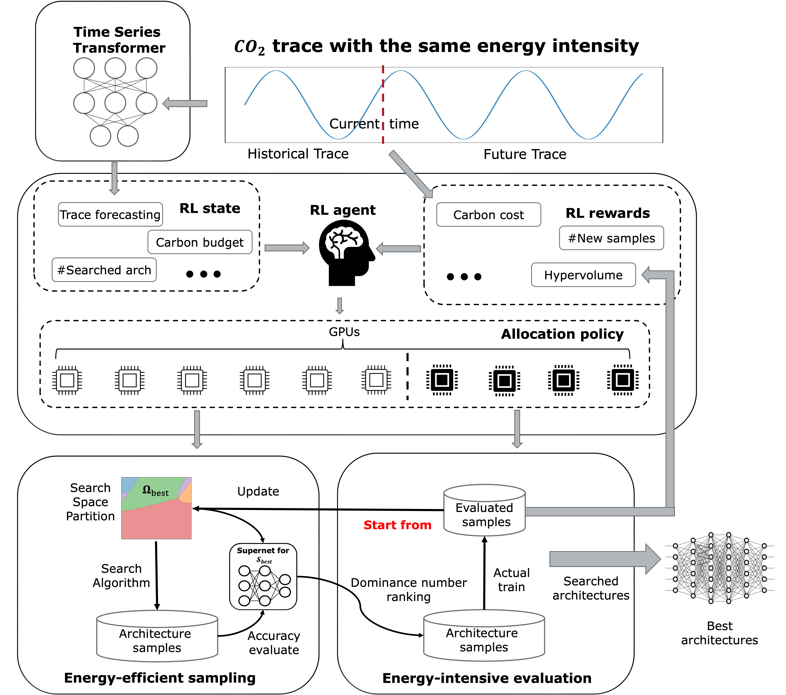

# CE-NAS: An End-to-End Carbon-Efficient Neural Architecture Search Framework

CE-NAS is an innovative, end-to-end Neural Architecture Search (NAS) framework designed to reduce the carbon footprint associated with NAS processes. By dynamically allocating GPU resources based on predicted carbon intensity using a reinforcement learning (RL) agent, CE-NAS balances energy-efficient sampling with energy-intensive evaluation tasks. The framework integrates a multi-objective optimizer and a time-series transformer to forecast carbon emissions, significantly lowering carbon consumption while achieving state-of-the-art results on various NAS datasets and open-domain tasks.

<p align="center">

</p>

## Environment Requirements
```
python >= 3.8, PyTorch >= 1.8.1, gpytorch >= 1.5.1
scipy, Botorch, Numpy, cma
```


## Run CE-NAS in NasBench201

This experiment is based on the NasBench201 dataset and carbon emission data from ElectricityMap Map. The carbon emission data is available at [ElectricityMap](https://github.com/carbonfirst/CO2Scrap). The NasBench201 dataset is available at [NAS-Bench-201](https://github.com/D-X-Y/NAS-Bench-201), we preprocessed the dataset and provide the data in [this](./lamoo/tasks/nasbench201/) folder. This experiment leverage different thread to simulate the different GPU resources for the sampling and evaluation process. 

The results of the experiment are saved in [this](./results/RL/) folder. During the experiments, the infomation of MCTS, A3C and the RL states, actions and rewards will be showing in the terminal.

### Run experiment command 

```
python cenas_RL.py
```
The default setting is to run the experiment based on the random search with [LaMOO](https://github.com/aoiang/LaMOO) on NasBench201. 

### Settings for the experiment
```
--sample_method "bayesian" or "random"
```
sample_method: The method to sample the architecture. "random" is the default method. 
```
--node_select "mcts" or "leaf"
```
node_select: The method to select the node in the search tree. "leaf" is the default method. 
```
--queueCapacity 
```
The maximum length of the gpu queue. Default setting is 10. 
```
--GPU_nums 
```
The total numbers of GPUs. Default setting is 8. 
```
--budget 
```
The time budget for the experiment. Default setting is 80 hours. 


## How to tune CE-NAS? 
###  **Cp**: exploration factor 
> python cenas_RL.py --cp "your value"  

> We typically set Cp to 0.1 times the maximum hypervolume of the problem. Cp controls the balance between exploration and exploitation. A larger Cp guides LaMOO to visit suboptimal regions more frequently. As a rule of thumb, set Cp to roughly 10% of the maximum hypervolume. When the maximum hypervolume is unknown, Cp can be dynamically set to 10% of the current samples' hypervolume in each search iteration.
of current samples in each search iteration. 

###  **Node selection method**: MCTS or Leaf
> python MCTS.py --node_select "mcts"/"leaf"

> MCTS: Traverse down the search tree to track the most promising search path and select the leaf node (Algorithm 1 in the paper).

> Leaf: LaMOO directly selects the leaf node with the highest UCB value, reducing optimization costs, especially in problems with many objectives.

###  **SVM kernel**: the type of kernels used by SVM

> python MCTS.py --kernel "linear"/"poly"/rbf

> From LaMOO experiments,the RBF kernel slightly outperforms others. The non-linearity of polynomial and RBF kernels results in better region partitions compared to the linear kernel.

### Other possible tunable parameters

> --degree (svm degree) 

> --gamma ([defination](https://scikit-learn.org/stable/modules/generated/sklearn.svm.SVC.html))

> --sample_num (sample numsbers per iteration)

> Reinforcement Learning parameters ([definition](A3C.py) line17-24. )

> Reinforcement Learning state, action, and reward parameters ([definition](a3c_params.py))

> Reinforcement Learning model architectures ([definition](RLnet.py))


## Paper
Please reference the following publication when using this package. OpenReview <a href="https://openreview.net/pdf?id=v6W55lCkhN">link</a>.
```
@inproceedings{
zhao2024cenas,
title={{CE}-{NAS}: An End-to-End Carbon-Efficient Neural Architecture Search Framework},
author={Yiyang Zhao and Yunzhuo Liu and Bo Jiang and Tian Guo},
booktitle={The Thirty-eighth Annual Conference on Neural Information Processing Systems},
year={2024},
url={https://openreview.net/forum?id=v6W55lCkhN}
}
```
